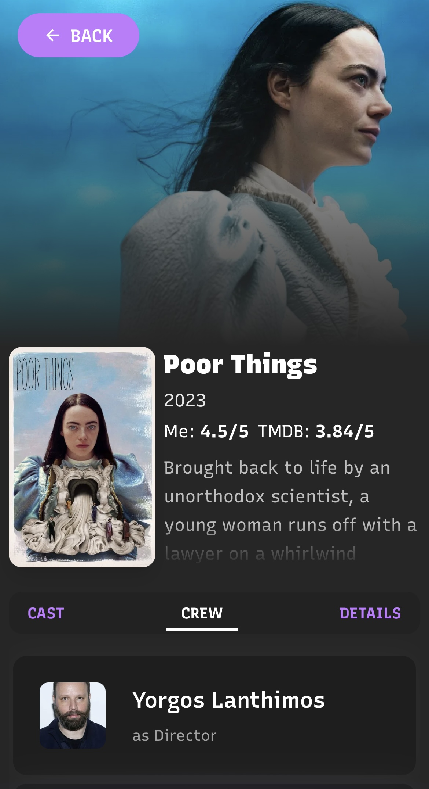

# Smllns Film Club

Smllns Film Club is a personal movie showcase website where I blend my passion for films and creative coding.  
Featuring a highly animated and visually rich UI, this project brings my favorite hobby to life through smooth transitions, interactive effects, and a unique visual style.

## Table of Contents

- [About](#about)
- [Features](#features)
- [Technologies](#technologies)
- [Special Thanks](#special-thanks)
- [Demo](#demo)
- [Contact](#contact)

## About

This site showcases my entire rated movie collection from **Letterboxd**—over **2000 films**—presented through a rich and dynamic **visual experience** filled with animations, smooth transitions, and interactive effects.

You can **browse** the full collection, **search** movies by **title** or **year**, and explore detailed movie pages enriched with posters and metadata from **The Movie Database (TMDb) API**.  
I’ve also curated **four unique movie lists** reflecting different themes and moods, and there is a dedicated **contact page** with all my social links.  
Each movie entry links back to its original **Letterboxd** page, combining the joy of discovery with a love for creative coding.

This project is my way to merge **code and creativity**, sharing my favorite hobby through an immersive web experience.

---

## Features

- **Full collection** of my rated movies from **Letterboxd** (over 2000 titles)
- **Powerful search** by **title** and **year**

- **Detailed movie pages** with external data integration (TMDb API)
- Four curated movie lists:
  - **Unhinged Women Who Self Destruct**
  - **Unusual Animation**
  - **Manic Pixie Dream Girling**
  - **Personal Favourites**
- **Contact page** with all my social media links
- **High-quality animations** and smooth **transitions** enhancing the user experience
- **Fully responsive design**: smooth experience on both desktop and mobile

  
  

---

## Technologies

- **React (Next.js) + TypeScript**
- **Tailwind CSS** for styling
- **PapaParse** for loading CSV data
- **TMDb API** integration for fetching movie posters and metadata
- **MongoDB** for caching posters and movie info to improve performance
- **Framer Motion** and **GSAP** for animations
- **Lenis** for smooth scrolling
- Uses **React Three Fiber** for _3D backgrounds_, enhanced with **@react-three/drei** for convenient ready-made 3D components and helpers

- **React Icons** for UI elements
- Various UI libraries for components and layouts: _hover.dev_, _Cult UI_, _UI Layouts_, _Magic UI_, _Aceternity UI_, _SparkUi_
- **Cursify** for a custom animated cursor

## Special Thanks

- **Pete Barr** — I reworked his component from CodePen for library hero section in this project.  
  [CodePen profile](https://codepen.io/petebarr) | [Original project](https://codepen.io/petebarr/pen/zYxPgKg)

- **Ksenia Kondrashova** — I reworked her component from CodePen for contacts section in this project.
  [CodePen profile](https://codepen.io/ksenia-k) | [Original project](https://codepen.io/ksenia-k/pen/NWmMxLg)

---

## Demo

You can try the live version of **Smllns Film Club** here:

[Live Demo](https://smllns-film-club.vercel.app/)

---

## Contact

Feel free to reach out for any questions, suggestions, or opportunities!  
Visit the **Contact** page on the site for all my social links and more ways to connect.

You can also find me here directly:

- **Email**: [marysmoly@gmail.com](mailto:marysmoly@gmail.com)
- **LinkedIn**: [linkedin.com/in/smllns](https://www.linkedin.com/in/smllns/)
- **GitHub**: [github.com/smllns](https://github.com/smllns)
- **Letterboxd**: [letterboxd.com/smllns](https://letterboxd.com/smllns)

I’m always happy to connect and collaborate.

---

_Smllns Film Club — where code meets creativity and the love of movies._
